<h2 align="center">BAB III 
ANALISIS DAN PERANCANGAN</h2>
 

<strong>3.1   Analisis</strong> 
&nbsp;&nbsp;&nbsp;&nbsp;&nbsp;&nbsp;Tahap analisis adalah tahap pemahaman terhadap suatu aplikasi yang telah dibuat. Dalam tahap ini bertujuan untuk mengetahui sistem dari aplikasi tersebut, proses-proses yang terlibat dalam aplikasi serta hubungan antar proses. Analisis juga sebagai penguraian atau penjelasan dari sebuah aplikasi yang utuh kedalam bagian-bagian komponennya dengan maksud untuk mengidentifikasi dan mengevaluasi masalah-masalah, kesempatan-kesempatan, hambatan-hambatan yang terjadi serta kebutuhan yang diharapkan sehingga terdapat usulan untuk perbaikan. 
&nbsp;&nbsp;&nbsp;&nbsp;&nbsp;&nbsp;Analisis adalah langkah awal untuk pengembangan aplikasi, karena perancangan dan pengembangan implementasi aplikasi tidak akan berjalan dengan baik tanpa adanya analisa terhadap aplikasi yang akan digunakan. Analisis juga dapat didefinisikan sebagai penguraian dari suatu sistem informasi yang utuh kedalam bagian-bagian komponennya dengan tujuan serta maksud untuk mengidentifikasi dan mengevaluasi masalah-masalah, kesempatan-kesempatan, hambatan-hambatan yang terjadi serta kebutuhan- kebutuhan yang diharapkan sehingga dapat diusulkan recovery atau perbaikan. 
 
<b>3.1.1  Analisis Sistem yang Sedang Berjalan</b> 
&nbsp;&nbsp;&nbsp;&nbsp;&nbsp;&nbsp;Tahapan yang di perlukan dalam pembuatan suatu program yaitu menganalisa sistem yang telah ada, dimana analisa sistem merupakan proses mempelajari suatu sistem dengan cara menguraikan sistem tersebut kedalam elemen yang membentuknya. Selanjutnya mengidentifikasi dan mengevaluasi permasalahan – permasalahan yang terjadi serta kebutuhan yang di perlukan, sehingga dapat di susulkan pembuatannya. 
 
<b>3.1.1.1  Analisis Prosedur Berjalan</b> 

 
Gambar 3.1 BPMN Absensi Mahasiswa Secara Manual  

Keterangan: 
&nbsp;&nbsp;&nbsp;&nbsp;&nbsp;&nbsp;Untuk menguji model di atas, maka hal yang harus dilakukan yaitu memvalidasi simulasi yang diberikan durations 2 jam 30 menit 6 detik untuk melakukan aktifitas absensi secara manual, dari mulai penginputan absensi oleh dosen sampai menjadi laporan absensi mahasiswa. Di model tersebut digambarkan bahwa jika simulasi dimulai 450, maka output yang dihasilkan juga harus sama yaitu 450. Oleh karena itu, simulasi dari model absensi secara manual di atas telah valid. Pada simulasi tersebut dijelaskan bahwa semua task dan start/end even dari mulai menginputkan absensi sampai mengkalkulasikan absensi mahasiswa yang memuat laporan absensi berinstance complete 450, kecuali estafet absensi mahasiswa, proses pengecekan absensi dan gateway dimana proses tersebut akan terus berulang sampai kertas absensi mahasiswa terisi penuh, sehingga nilai instance complete yang didapat akan lebih dari 450 yaitu bernilai 902. Adapun hasil simulasi tersebut (result) adalah sebagai berikut: 

  
Gambar 3.2 Result BPMN Absensi Mahasiswa Secara Manual  

 

&nbsp;&nbsp;&nbsp;&nbsp;&nbsp;&nbsp;Adapun dalam hal pemberitahuan kehadiran mahasiswa atau monitoring absensi mahasiswa pada proses yang sedang berjalan di Program Studi Diploma IV Teknik Informatika Politeknik Pos Indonesia saat ini tidak sampai secara langsung kepada orang tua. Pemberitahuan kehadiran hanya sampai pada mahasiswanya sendiri yang diberitahukan pada saat perwalian dengan dosen. 
 
<b>3.1.1.2  Analisis Dokumen yang Digunakan</b> 
&nbsp;&nbsp;&nbsp;&nbsp;&nbsp;&nbsp;Didalam proses absensi mahasiswa terdapat beberapa dokumen yang terlibat. Berikut ini adalah dokumen-dokumen yang dibutuhkan dalam sistem penjadwalan : 
 
Tabel 3.1 Data Prodi 
Dibuat oleh	    :	Admin 
Ditujukan untuk	:	Admin  
Isi	            :	prodi_kd, nama_prodi  
Tujuan	        :	Pengelolaan data prodi 
Frekuensi	    :	Fleksibel 
 
Tabel 3.2 Data Dosen 
Dibuat oleh	    :	Admin 
Ditujukan untuk	:	Admin & Operator 
Isi	            :	Dosen_kd, dosen_nama, dosen_alamat, dosen_email, dosen_status 
Tujuan	        :	Data mentahan untuk pembuatan jadwal 
Frekuensi	    :	Setahun sekali 
 
Tabel 3.3 Data Kelas 
Dibuat oleh	    :	Admin 
Ditujukan untuk	:	Admin 
Isi	            :	kd_kelas, nama_kelas 
Tujuan	        :	Untuk pengelolaan pembagian kelas 
Frekuensi	    :	Setahun sekali 
 
Tabel 3.4 Data Matakuliah 
Dibuat oleh	    :	Admin 
Ditujukan untuk	:	Admin & Operator 
Isi	            :	Matkul_kd, matkul_nama, matkul_jenis, matkul_sks, matkul_jam_teori, matkul_jam_praktek, matkul_total_jam, matkul_semester, matkul_thn_kurikulum, nama_prodi 
Tujuan	        :	Untuk pengelolaan mata kuliah dan data mentahan untuk pembuatan absensi. 
Frekuensi	    :	Enam bulan sekali  
 
Tabel 3.5 Data ruangan 
Dibuat oleh	    :	Operator 
Ditujukan untuk	:	Admin 
Isi	            :	Kd_ruangan, no_ruangan, lantai_ruangan, jns_ruangan, ruangan_status 
Tujuan	        :	Untuk pengelolaan ruangan kelas dan data mentahan untuk pembuatan absensi. 
Frekuensi	    :	Tidak ada patokan 
 
Tabel 3.6 Data Jadwal 
Dibuat oleh	    :	Admin & Operator 
Ditujukan untuk	:	Admin & Operator 
Isi	            :	Kd_jadwal, matakuliah, hari, kelas, dosen, jam, ruangan, prodi 
Tujuan	        :	Untuk pembuatan absensi 
Frekuensi	    :	6 bulan sekali 
 
Tabel 3.7 Data Absensi 
Dibuat oleh	    :	Admin & Operator 
Ditujukan untuk	:	Admin & Operator 
Isi	            :	Kd_absensi, tanggal, hari, kelas, matakuliah, jam, ruangan, keterangan kehadiran (hadir, sakit, ijin, alfa) 
Tujuan	        :	Untuk mengelola data absensi 
Frekuensi	    :	Fleksibel 
 
Tabel 3.8 Data Kelompok 
Dibuat oleh	    :	Admin 
Ditujukan untuk	:	Admin 
Isi	            :	Admin_level_kode, admin_level_nama, admin_level_status 
Tujuan	        :	Untuk mengelompokan pengguna/actor 
Frekuensi	    :	Fleksibel 
 
Tabel 3.9 Data Mahasiswa 
Dibuat oleh	    :	Admin 
Ditujukan untuk	:	Admin 
Isi	            :	Npm, nama mahasiswa, alamat mahasiswa, no hp mahasiswa, nama orangtua/wali, notelp orang tua/wali, alamat orangtua/wali, 
Tujuan	        :	Untuk mengelola data mahasiswa 
Frekuensi	     :	Fleksibel 
 
Tabel 3.10 Data Pelanggaran 
Dibuat oleh	    :	Admin 
Ditujukan untuk	:	Admin, Mahasiswa/ortu, dosen 
Isi	            :	Pelanggaran id, jenis pelanggaran, point 
Tujuan	        :	Untuk menentukan mahasiswa mendapatkan pelanggaran seperti SP1,SP2,SP3 atau dropout 
Frekuensi	    :	Fleksibel 
 

<b>3.1.2  Analisis Sistem yang akan Dibangun</b> 
<b>3.1.2.1  Analisis Prosedur yang akan dibangun</b> 

 
Gambar 3.3 BPMN Monitoring Absensi Mahasiswa via sms 

&nbsp;&nbsp;&nbsp;&nbsp;&nbsp;&nbsp;Adapun sub proses dari proses login pada BPMN Monitoring Absensi Mahasiswa via sms adalah sebagai berikut: 

  
Gambar 3.4 BPMN Sub Proses Login 

Keterangan: 

&nbsp;&nbsp;&nbsp;&nbsp;&nbsp;&nbsp;Pada model gambar 3.3, salah satu proses tersebut memeliki sub proses yaitu login, yang dijelaskan pada gambar 3.4. Untuk menguji model di atas, maka hal yang harus dilakukan yaitu memvalidasi simulasi yang diberikan durations 50 menit untuk melakukan monitoring absensi mahasiswa via sms, dari mulai penginputan absensi oleh dosen sampai orang tua menerima info pelanggaran melalui sms atau tidak mendapatkan sms info pelanggaran. Di model tersebut digambarkan bahwa jika simulasi dimulai 450, maka output yang dihasilkan juga harus sama yaitu 450, yaitu 158 yang tidak menerima sms info pelanggaran, dan 292 menerima sms info pelanggaran dengan list 147 mendapat SP1, 72 mendapat SP2 dan 73 mendapat SP3. Oleh karena itu, simulasi dari model monitoring absensi mahasiswa via sms di atas telah valid. Adapun hasil simulasi tersebut (result) adalah sebagai berikut: 

  
Gambar 3.5 Result BPMN Monitoring Absensi Mahasiswa via sms 

  
Gambar 3.6 BPMN Monitoring Absensi Mahasiswa via web 

Keterangan: 

&nbsp;&nbsp;&nbsp;&nbsp;&nbsp;&nbsp;Untuk menguji model di atas, maka hal yang harus dilakukan yaitu memvalidasi simulasi yang diberikan durations 50 menit untuk melakukan aktifitas absensi secara manual, dari mulai login oleh mahasiswa atau orangtua sampai display abesensi mahasiswa. Di model tersebut digambarkan bahwa jika simulasi dimulai 450, maka output yang dihasilkan juga harus sama yaitu 450. Oleh karena itu, simulasi dari model absensi secara manual di atas telah valid. Pada simulasi tersebut dijelaskan bahwa semua task dan start/end even dari mulai mulai login oleh mahasiswa atau orangtua sampai display abesensi mahasiswa berinstance complete 450, kecuali input npm dan password, kelola login dan gateway dimana proses tersebut akan terus berulang sampai npm dan password yang diinputkan dinyatakan valid oleh sistem, sehingga nilai instance complete yang didapat akan lebih dari 450 yaitu bernilai 880. Adapun hasil simulasi tersebut (result) adalah sebagai berikut: 

  
Gambar 3.7 Result BPMN Monitoring Absensi Mahasiswa via web 

 
<b>3.1.2.2  Analisis Kebutuhan Aplikasi</b> 

&nbsp;&nbsp;&nbsp;&nbsp;&nbsp;&nbsp;Kebutuhan fungsional dari sistem monitoring absensi mahasiswa adalah sebagai berikut: 
1.	Proses Monitoring Absensi Mahasiswa via sms 
&nbsp;&nbsp;&nbsp;&nbsp;&nbsp;&nbsp;Pada proses absensi yang berjalan sekarang di Program Studi D4 Teknik Informatika Politeknik Pos Indonesia belum terbuka untuk orangtua. Jika mahasiswa mendapatkan pelanggaran, pemberitahuannya hanya sampai kepada mahasiswa sendiri melalui dosen. Jadi, orang tau tidak tahu apabila anaknya betul betul hadir dalam perkuliahan atau sebaliknya. 
Untuk itu, proses monitoring absensi mahasiswa sangatlah penting, guna untuk mengontrol kehadiran mahasiswa. Adapun salah satu cara untuk memonitoringnya yaitu melalui sms. Jadi sistem akan mengirikan sms kepada orangtua apabila anaknya mendapatkan pelanggaran terkait absensi perkuliahan yaitu berupa SP1, SP2, SP3 atau dropout. Adapun yang menerima sms ini hanya orang tua mahasiswa, yang dikirimkan oleh admin atau BAAK melalui sistem. 
2.	Proses View Absensi Mahasiswa 
&nbsp;&nbsp;&nbsp;&nbsp;&nbsp;&nbsp;Pada proses absensi yang sedang berjalan saat ini di Prodi D4 Tenik Infomatika Politeknik Pos Indonesia, mahasiswa tidak bisa melihat absensi dirinya sendiri di web. Apabila mahasiswa ingin melihat absensinya, beliau harus datang ke prodi atau BAAK untuk melihat absensinya. Oleh karena itu, dengan sistem yang akan dibuat nanti, mahasiswa bisa melihat absensinya dengan memasukan username dan password (login) di web absensi nanti. Adapun yang dapat melihat absensi ini semua jenis user bisa melihatnya seperti BAAK, dosen, orangtua atau mahasiswa. 

 
<b>2.1.2.3	Analisis Kebutuhan Perangkat Lunak dan Perangkat Keras</b> 
1)	Perangkat Lunak yang digunakan untuk membuat aplikasi ini meliputi: 
a.	Sistem Operasi	    : Windows 10 pro. 
b.	Editor Teks	        : Bracket. 
c.	Editor Grafik	    : Photoshop, Paint.  
d.	Web script language	:HTML,Javascript dan PHP Framework. 
e.	Database server	    : MySQL. 
f.	Client Application	: Google Chrome 	
 
2)	Perangkat Keras minimal yang digunakan untuk membuat aplikasi ini 
a.	untuk server meliputi: 
1)	Processor Intel Core i3 
2)	Memory  2 GB. 
3)	Harddisk 300 GB. 
4)	Modem Online Manager 
b.	untuk User  meliputi: 
1)	Processor Intel Dual Core 
2)	Memory  1 GB. 
3)	Harddisk 300 GB. 

2.2	Perancangan
Perancangan merupakan tahapan analisis untuk mendefinisikan kebutuhan-kebutuhan fungsional yang menggambarkan bagaimana suatu aplikasi dibentuk. 
Perancangan dapat berupa penggambaran, perencanaan, dan pembuatan sketsa atau pengaturan dari beberapa elemen yang terpisah ke dalam satu kesatuan yang utuh dan mempunyai fungsi tersendiri, termasuk menyangkut konfigurasi dari komponen-komponen perangkat lunak, dan keras suatu aplikasi. 
Perancangan ini menitik beratkan kepada perancangan data yang ada pada aplikasi, tahap perancangan data pada perangkat lunak tersebut dipakai ke dalam permodelan yang umum yang digunakan yaitu menggunakan Use Case Diagram, Class Diagram, Sequence Diagram, Communication Diagram, Activity Diagram, Statechart Diagram, Component Diagram, Deployment Diagram,  Struktur Menu dan Perancangan Antarmuka.

3.2.1   Use Case Diagram
Adapun use case diagram dari sistem monitoring absensi mahasiswa adalah sebagai berikut:

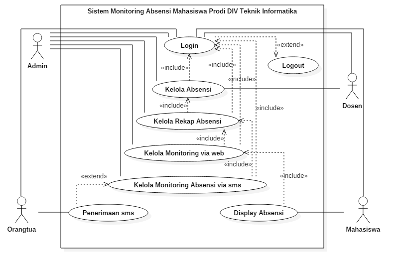 
Gambar 3.8  Use Case Diagram Sistem Monitoring Absensi Mahasiswa

Tabel 3.11 Definisi Aktor
No	Aktor	Keterangan
1	Admin 	Melakukan login, pengelolaan data master untuk absensi meliputi data admin, data dosen, data matakuliah, data kelas, data mahasiswa, pengelolaan jadwal, pengelolaan absensi, dan terkhusus bagi sub modul monitoring absensi mahasiswa ini yaitu pengelolaan monitoring absensi via sms dan web
2	Dosen	Dosen Melakukan login, mengelola data absensi
3	Orangtua	Melakukan login, monitoring absensi via sms (penerimaan sms) dan melihat absensi via web
4	Mahasiswa	Melakukan login, melihat absensi via web

Tabel 3.12 Definisi Use Case
No.	Aktor	Keterangan
1	Login 	Melakukan proses login 
2	Kelola Absensi	Melakukan pengelolaan data dosen
3	Kelola Rekap Absensi	Melakukan pengelolaan data kurikulum
4	Kelola Monitoring Absensi via sms	Melakukan Pengelolaan data ruangan
5	Kelola Monitoring Absensi via web	Melakukan backup dan restore data
6	Penerimaan SMS	Menerima pemberitahuan terkait absensi mahasiswa kepada orangtua
7	Display Absensi	Melihat absensi mahasiswa

Tabel 3.13 Skenario Use Case Login
Identifikasi
Nomor	1
Nama	LOGIN
Tujuan	Melakukan login untuk masuk halaman utama
Deskripsi	Login dengan memasukan Username dan Password
Aktor	Admin (BAAK), Dosen, Mahasiswa, Orangtua
Skenario
Kondisi Awal	Menampilkan form login
Aksi Aktor	Reaksi Sistem
1.    Aktor meminta fasilitas login kepada sistem 	2.     Menampilkan form login
3.    Memasukan Username dan Password	4. Melakukan proses validasi
jika salah keduanya muncul pesan “Username dan Password yang anda masukan tidak cocok”.
	
	5. Jika masih salah, kembali ke form login.
	6. Jika benar maka akan ditampilkan form halaman utama.
Kondisi Akhir	Menampilkan form halaman utama

Tabel 3.14 Skenario Use Case Kelola Absensi
Identifikasi
Nomor	2
Nama	KELOLA_ABSENSI
Tujuan	Melakukan pengelolaan absensi 
Deskripsi	Melakukan pengelolaan absensi mahasiswa yang diambil dari data master absensi mahasiswa seperti data mahasiswa, data dosen, matakuliah, kelas, prodi, data jadwal. dll.
Aktor	Admin dan Dosen
Skenario
Kondisi Awal	Menampilkan form kelola absensi
Aksi Aktor	Reaksi Sistem
Memulai Aplikasi	Menampilkan form kelola absensi
1.  Pilih menu kelola absensi mahasiswa	2.  Menampilkan halaman kelola absensi mahasiswa
3.	Aktor memilih fasilitas pengelolaan absensi mahasiswa yaitu tambah absensi, edit data absensi, delete data absensi dan view data absensi	4.	Sistem ke halaman yang diminta sesuai dengan fasilitas yang dilakukan
5.	Aktor memilih fasilitas tambah data	6.	Sistem memunculkan data grid view sesuai dengan yang telah diinputkan aktor

Tabel 3.15 Skenario Use Case Kelola Rekap Absensi
Identifikasi
Nomor	3
Nama	KELOLA_REKAP_ABSENSI
Tujuan	Melakukan pengelolaan rekap absensi 
Deskripsi	Melakukan pengelolaan rekap absensi mahasiswa yang diambil dari data absensi
Aktor	Admin 
Skenario
Kondisi Awal	Menampilkan form kelola rekap absensi
Aksi Aktor	Reaksi Sistem
Memulai Aplikasi	Menampilkan form kelola absensi rekap
1.  Pilih menu kelola rekap absensi mahasiswa	2.  Menampilkan halaman kelola rekap absensi mahasiswa
3.	Aktor memilih fasilitas pengelolaan rekap absensi mahasiswa yaitu tambah rekap absensi, edit rekap absensi, delete rekap absensi dan view data rekap absensi	4.	Sistem ke halaman yang diminta sesuai dengan fasilitas yang dilakukan
5.	Aktor memilih fasilitas tambah data	6.	Sistem memunculkan data grid view sesuai dengan yang telah diinputkan aktor

Tabel 3.16 Skenario Use Case Monitoring Absensi via sms
Identifikasi
Nomor	4
Nama	MONITORING ABSENSI VIA SMS
Tujuan	Melakukan pengelolaan monitoring absensi via sms 
Deskripsi	Melakukan monitoring absensi mahasiswa via sms dengan mengirimkan sms pemberitahuan SP ke orang tua
Aktor	Admin 
Skenario
Kondisi Awal	Menampilkan form kirim sms
Aksi Aktor	Reaksi Sistem
Memulai Aplikasi	Menampilkan form kirim sms
1.	Pilih menu kirim sms	2.	Menampilkan halaman kelola kirim sms
3.	Aktor memilih fasilitas atau fitur monitoring absensi via sms seprti data phonebook, dan kirim sms (tambah) 	4.	Sistem ke halaman yang diminta sesuai dengan fasilitas yang dilakukan
5.	Aktor memilih mengetikan informasi tentang absensi ke orang tua	6.	Mengirimkan sms pemberitahuan SP ke orang tua

Tabel 3.17 Skenario Use Case Monitoring Absensi via web
Identifikasi
Nomor	5
Nama	MONITORING ABSENSI VIA WEB
Tujuan	Melakukan pengelolaan monitoring absensi via web
Deskripsi	Melakukan monitoring absensi mahasiswa via web dengan menampilkan absensi di halaman web
Aktor	Admin 
Skenario
Kondisi Awal	Menampilkan form display absensi
Aksi Aktor	Reaksi Sistem
Memulai Aplikasi	Menampilkan form display absensi
1.  Pilih menu abensi	2. Menampilkan halaman kelola absensi
3. Aktor memilih fasilitas atau fitur monitoring absensi via web view absensi mahasiswa	4. Sistem ke halaman yang diminta sesuai dengan fasilitas yang dilakukan

Tabel 3.18 Skenario Use Case Penerimaan SMS 
Identifikasi
Nomor	8
Nama	PENERIMAAN SMS
Tujuan	Mengontrol mahasiswa terkait absensi
Deskripsi	Orangtua menerima sms pemberitahuan SP terkait kehadiran anaknya
Aktor	Orangtua
Skenario
Kondisi Awal	Akumulasi kehadiran
Aksi Aktor	Reaksi Sistem
Admin mengirimkan pemberitahuan terkait absensi	Sms sending kepada orangtua mahasiswa
Menerima sms	Sms delivered

Tabel 3.19 Skenario Use Case Display Absensi Mahasiswa 
Identifikasi
Nomor	8
Nama	DISPLAY ABSENSI
Tujuan	Melihat absensi mahasiswa via web
Deskripsi	Melihat absensi mahasiswa via web yang sebelumnya telah diinputkan oleh yang bersangkutan.
Aktor	Mahasiswa dan Orangtua
Skenario
Kondisi Awal	Menampilkan form absensi mahasiswa via web
Aksi Aktor	Reaksi Sistem
Memulai Aplikasi	Menampilkan halaman utama
1.  Pilih menu lihat absensi mahasisa	2.  Menampilkan halaman absensi mahasiswa via web

3.2.2	Class Diagram
Class Diagram adalah diagram UML yang menggambarkan kelas-kelas dalam sebuah sistem dan hubungannya antara satu dengan yang lain, serta dimasukkan pula atribut dan operasi. Class Diagram pada aplikasi sebagai berikut:

 
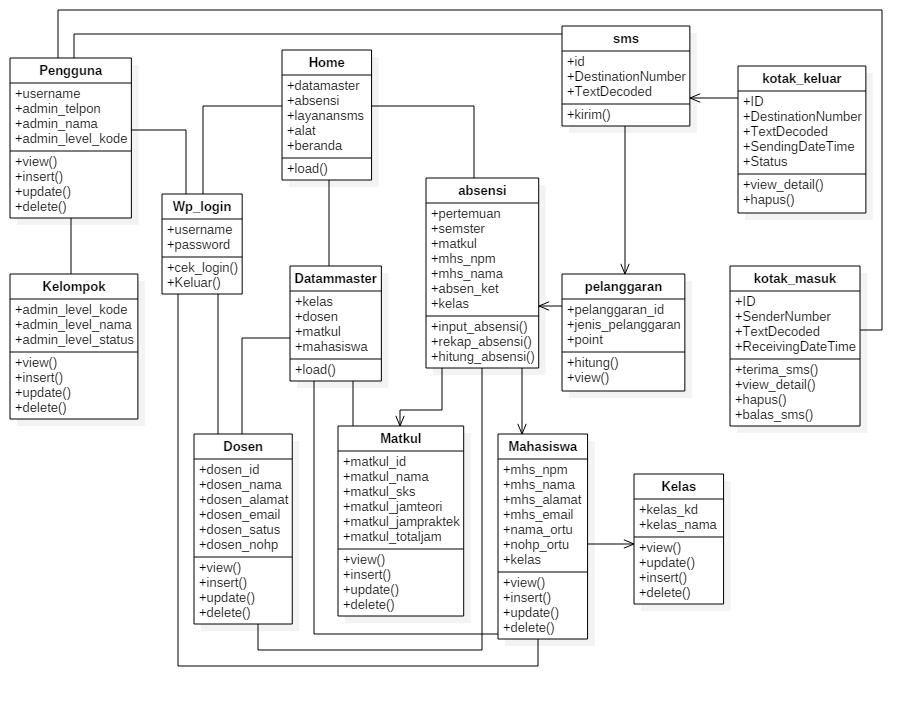
Gambar 3.9 Class Diagram Sistem Monitoring Absensi Mahasiswa

3.2.3	Sequence Diagram
Sequence Diagram merupakan penggambaran keterhubungan atau interaksi antar objek dalam suatu jangka waktu. Sequence Diagram terutama menampilkan interaksi antara pengguna (user) dengan sistem.

3.2.3.1  Sequence Diagram Login Untuk Admin

 
Gambar 3.10 Sequence Diagram Login untuk Admin
Keterangan:
Ketika aktor admin ingin masuk ke halaman utama admin, terlebih dahulu aktor harus login. Proses yang ditempuh yaitu:
1.	Admin membuka UI login
2.	Lalu masukan username dan password
3.	Sistem akan mengoneksikan terlebih dahulu kepada database, jika data yang dimasukan sesuai makan akan masuk ke halaman utama admin.

3.2.3.2  Sequence Diagram Login Untuk Dosen

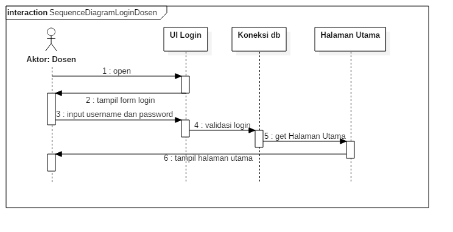 
Gambar 3.11 Sequence Diagram Login untuk Dosen

Keterangan:
Ketika aktor admin ingin masuk ke halaman utama dosen, terlebih dahulu aktor harus login terlebih dahulu. Proses yang ditempuh yaitu:
1.	Admin membuka UI login
2.	Lalu masukan username dan password
3.	Sistem akan mengoneksikan terlebih dahulu kepada database, jika data yang dimasukan sesuai makan akan masuk ke halaman utama admin.

3.2.3.3  Sequence Diagram Login Untuk Orangtua

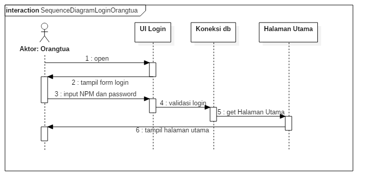 
Gambar 3.12 Sequence Diagram Login untuk Orangtua

Keterangan:
Ketika aktor orangtua ingin masuk ke halaman utama orangtua, terlebih dahulu aktor harus login terlebih dahulu. Proses yang ditempuh yaitu:
1.	Orangtua membuka UI login
2.	Lalu masukan NPM dan password dari anaknya (mahasiswa).
3.	Sistem akan mengoneksikan terlebih dahulu kepada database, jika data yang dimasukan sesuai maka akan masuk ke halaman utama orangtua.

3.2.3.4  Sequence Diagram Login Untuk Mahasiswa

 
Gambar 3.13 Sequence Diagram Login untuk Mahasiswa
Keterangan:
Ketika aktor mahasiswa ingin masuk ke halaman utama mahasiswa, terlebih dahulu aktor harus login terlebih dahulu. Proses yang ditempuh yaitu:
1.	Mahasiswa membuka UI login
2.	Lalu masukan NPM dan password mahasiswa
3.	Sistem akan mengoneksikan terlebih dahulu kepada database, jika data yang dimasukan sesuai maka akan masuk ke halaman utama mahasiswa.

3.2.3.5  Sequence Diagram Kelola Absensi untuk Admin

 
Gambar 3.14 Sequence Diagram Kelola Absensi untuk Admin
Keterangan:
1.	Admin membuka halaman utaman dan memilih masuk ke menu absensi. Dimana data absensi tersebut diambil dari data master absensi mahasiswa meliputi data matakuliah, dosen, mahasiswa, ruangan, kelas, jadwal.
2.	Sebelum melakukan input absensi, admin harus memasukan terlebih dahulu kelas dan matakuliahnya. Seletah itu, admin bisa melakukan tambah, edit, simpan, hapus data absensi dengan eksekusi query dalam controller absensi.

3.2.3.6  Sequence Diagram Kelola Absensi untuk Dosen

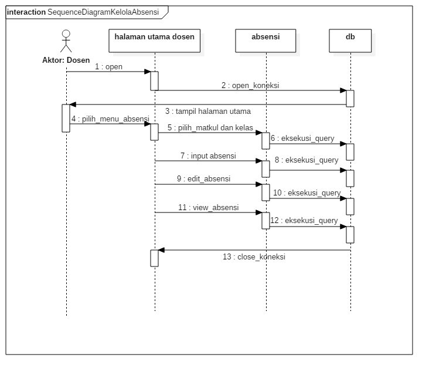 
Gambar 3.15 Sequence Diagram Kelola Absensi untuk Dosen
Keterangan:
1.	Dosen membuka halaman utaman dan memilih masuk ke menu absensi. Dimana data absensi tersebut diambil dari data master absensi mahasiswa meliputi data matakuliah, dosen, mahasiswa, ruangan, kelas, jadwal.
2.	Sebelum melakukan input absensi, dosen harus memasukan terlebih dahulu kelas dan matakuliahnya. Seletah itu, dosen bisa melakukan tambah, edit, simpan data absensi dengan eksekusi query dalam controller absensi.

3.2.3.7  Sequence Diagram Kelola Absensi Rekap Absensi

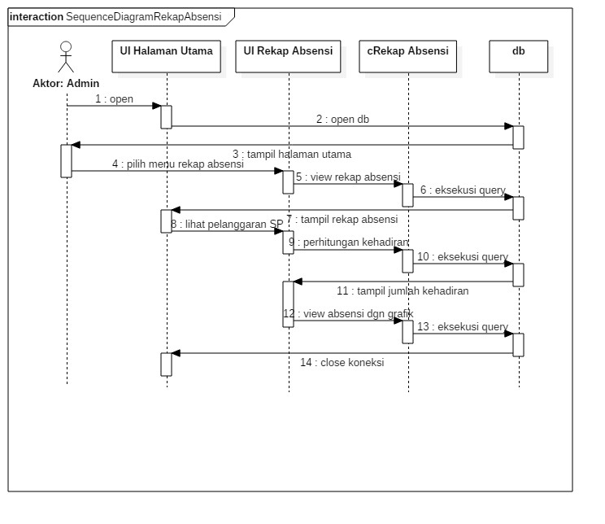 
Gambar 3.16 Sequence Diagram Kelola Rekap Absensi

Keterangan:
Dosen membuka halaman utaman dan memilih masuk ke sub menu rekap absensi yang terdapat dalam menu absensi. Dimana data rekap absensi tersebut diambil dari data absensi.

3.2.3.8  Sequence Diagram Monitoring Absensi via sms

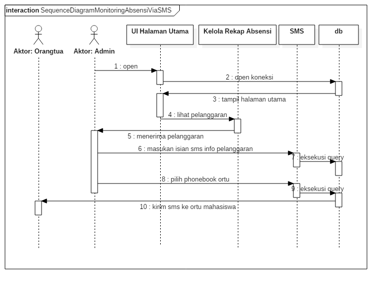 
Gambar 3.17 Sequence Diagram Monitoring Absensi via SMS
Keterangan:
1.	Admin membuka halaman utama dan memilih masuk ke menu absensi dan melihat pelanggaran yang ada. 
2.	Kemudian admin mengirimkan sms yang ditujukan ke no orang tua mahasiswa untuk megirikan pemberitahuan atau informasi bahwa anaknya mendapatkan SP1, SP2 atau SP3. 

3.2.3.8  Sequence Diagram Monitoring Absensi via Web

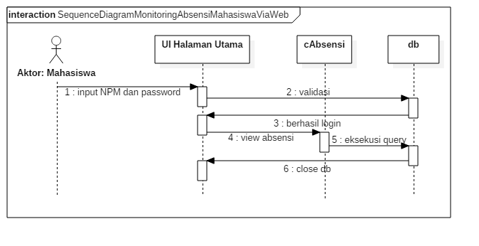 
Gambar 3.18 Sequence Diagram Monitoring Absensi via Web Mahasiswa

  
Gambar 3.19 Sequence Diagram Monitoring Absensi via Web Orangtua
Keterangan:
Mahasiswa dan orangtua bisa melihat kehadiran mahasiswa dengan mengakses web absensi mahasiswa. Dimana mahasiswa dan orangtua sudah diberikan akun untuk mengaksesnya berupa npm dan password.

3.2.4   Communication Diagram
3.2.4.1  Communication Diagram Login

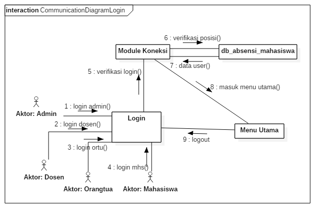  
Gambar 3.20 Communication Diagram Login

3.2.4.2  Communication Diagram Kelola Absensi

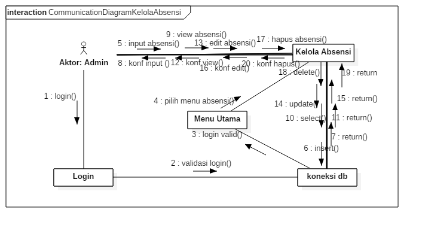 
Gambar 3.21 Communication Diagram Kelola Absensi

3.2.4.3  Communication Diagram Rekap Absensi 

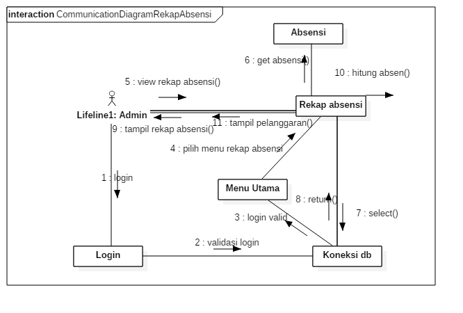 
Gambar 3.22 Communication Diagram Kelola Rekap Absensi

3.2.4.4  Communication Diagram Kelola Monitoring Absensi via SMS

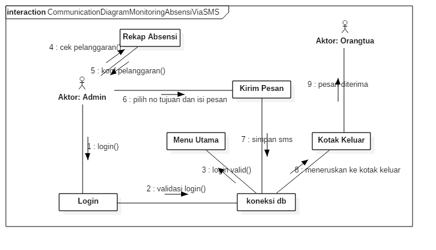 
Gambar 3.23 Communication Diagram Kelola Monitoring Absensi via SMS

3.2.4.5  Communication Diagram Diagram Kelola Monitoring Absensi via Web

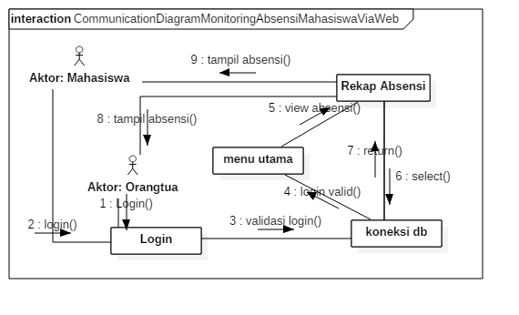 
Gambar 3.24 Communication Diagram Kelola Monitoring Absensi via Web

3.2.5   Activity Diagram
Berikut ini digambarkan activity diagram yang memperlihatkan alur jalannya Sistem Monitoring Absensi Mahasiswa DIV Teknik Informatika Politeknik Pos Indonesia: 

3.2.5.1  Activity Diagram Login

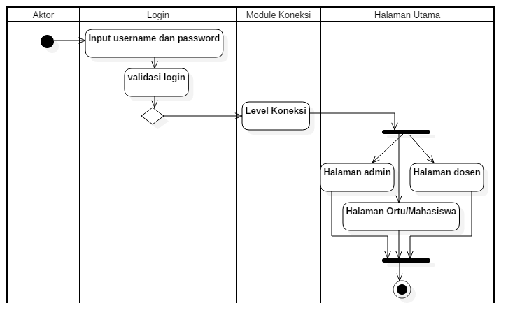 
Gambar 3.25 Activity Diagram Login
Keterangan:
Untuk mengakses sistem absensi mahasiswa terlebih dahulu aktor harus login dengan memasukan username dan password lalu klik tombol login di UI Login lalu sistem akan memvalidasi inputan yang dimasukan aktor dan dihubungkan dengna level koneksi. Jika data sesuai, maka akan diteruskan ke halaman utama sistem absensi mahasiswa diantaranya halaman utama admin dan halaman utama dosen dan halaman utama mahasiswa atau orang tua sesuai dengan level hak akses.

3.2.5.2  Activity Diagram Kelola Absensi

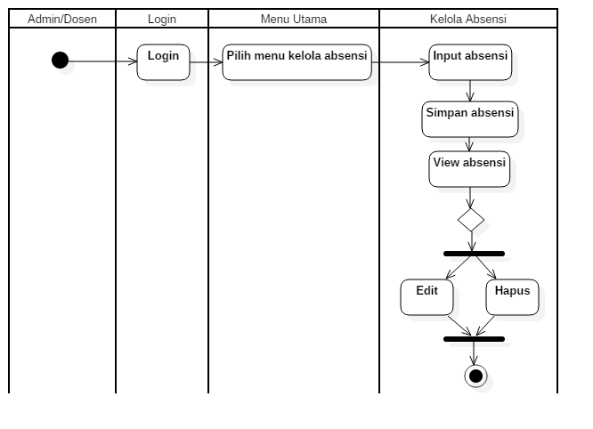
Gambar 3.26 Activity Diagram Kelola Absensi
Keterangan:
Setelah dosen berhasil login, ketika ingin menambahkan, edit atau hapus data dosen maka aktivitas yang dilakukan yaitu pertama pilih menu absensi dan pilih sub menu absensi lalu masukan data absensi sesuai dengan keadaan mahasiswa klik simpan. Maka sistem akan menampilkan data yang berhasil tersimpan. Jika ada kesalahan maka klik ubah untuk mengoreksi atau klik hapus untuk menghapus data yang ada khusus untuk admin.

3.2.5.3  Activity Diagram Kelola Rekap Absensi

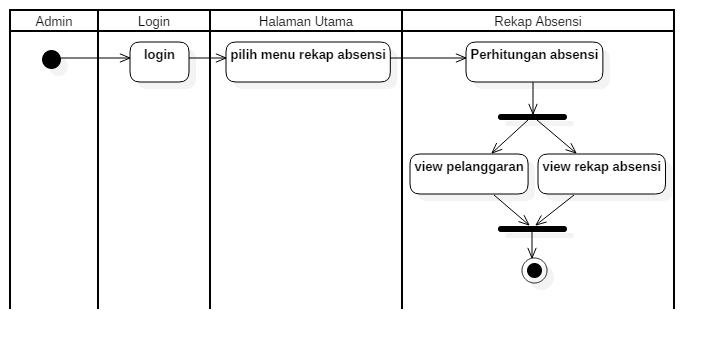 
Gambar 3.27 Activity Diagram Kelola Rekap Absensi
Keterangan:
Setelah admin berhasil login, maka admin diberikan izin untuk melihat rekapan absensi yang merupakan kumpulan dari absensi yang diinputkan dosen ketika masuk untuk mengajar kepada mahasiswa. Dimana dalam rekap absensi jumlah dari keterangan kehadiran seperti sakit, ijin, alfa dan hadir akan dikalkulasikan. 

3.2.5.4  Activity Diagram Kelola Monitoring Absensi Mahasiswa via SMS

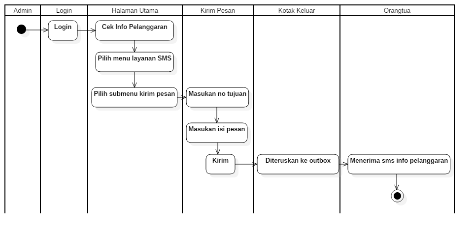 
Gambar 3.28 Activity Diagram Kelola Monitoring Absensi via SMS

Keterangan:
Setelah admin berhasil login, proses kirim sms ini dilakukan ketika admin menerima info tentang pelanggaran seperti SP1, SP2, SP3 dari menu rekap absensi. Ketika ada mahasiswa yang mendapatkan pelanggaran di atas, admin mengirimkan sms pemberitahuan kepada orangtua yaitu dengan dimasukannya no hp orang tua dan isi pesan bahwa anaknya telah mendapatkan pelanggaran tersebut.

3.2.5.5  Activity Diagram Kelola Monitoring Absensi Mahasiswa via Web

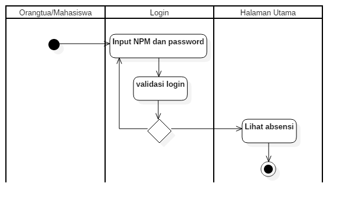 
Gambar 3.29 Activity Diagram Kelola Monitoring Absensi Mahasiswa via Web

Keterangan:
Sebenarnya untuk melihat absensi ini semua aktor bisa melihat absensi, tetapi yang ditekankan dalam memonitoring absensi mahasiswa ini jadi orangtua dan mahasiswa bisa mengetahui absensinya melalui web ini dengan syarat mahasiswa atau orang tua harus login terlebih dahulu dengan memasukan NPM dan passwordnya. 

3.2.6   Statechart Diagram
3.2.6.1   Statechart Diagram Login

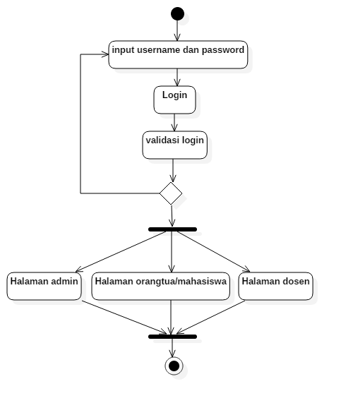 
Gambar 3.30 Statechart Diagram Login
Keterangan:
Untuk mengakses sistem monitoring absensi mahasiswa terlebih dahulu aktor harus login terlebih dahulu dengan memasukan username dan password lalu klik tombol login di UI Login lalu sistem akan memvalidasi inputan yang dimasukan aktor dan dihubungkan dengna level koneksi. Jika data sesuai, maka akan diteruskan ke halaman utama sistem monitoring absensi mahasiswa diantaranya halaman utama admin dan halaman utama dosen dan halaman utama orangtua/mahasiswa sesuai dengan level hak akses.
3.2.6.2   Statechart Diagram Kelola Absensi
 
Gambar 3.31 Statechart Diagram Kelola Absensi

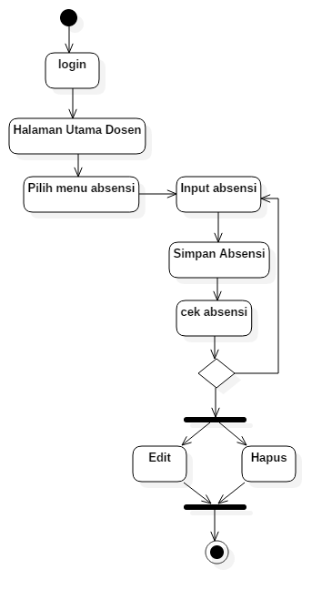
Keterangan:
Setelah admin berhasil login, ketika ingin menambahkan, edit atau hapus data absensi maka aktivitas yang dilakukan yaitu pertama pilih menu absensi lalu pilih inputkan absensi mahasiswa sesuai dengan realita lalu klik simpan. Maka sistem akan menampilkan data yang berhasil tersimpan. Jika ada kesalahan maka klik ubah untuk mengoreksi atau klik hapus untuk menghapus data yang ada.

3.2.6.3   Statechart Diagram Kelola Rekap Absensi

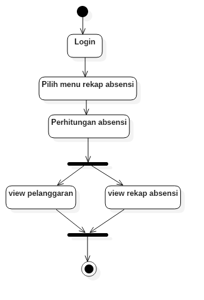 
Gambar 3.32 Statechart Diagram Kelola Rekap Absensi
Keterangan:
Setelah admin berhasil login, maka admin diberikan izin untuk melihat rekapan absensi yang merupakan kumpulan dari absensi yang diinputkan dosen ketika masuk untuk mengajar kepada mahasiswa. Dimana dalam rekap absensi jumlah dari keterangan kehadiran seperti sakit, ijin, alfa dan hadir akan dikalkulasikan. 

3.2.6.4   Statechart Diagram Monitoring Absensi Mahasiswa via SMS
 
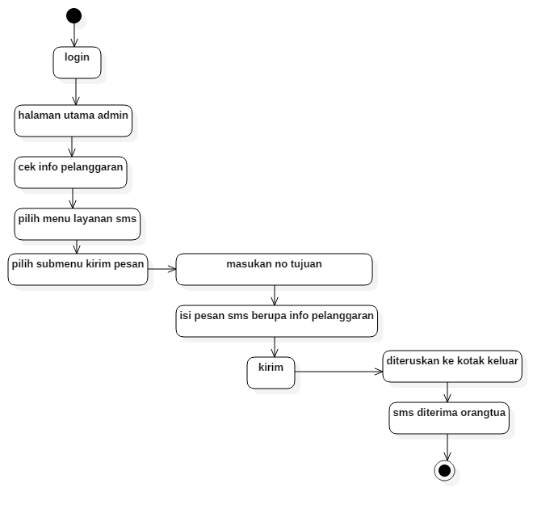
Gambar 3.33 Statechart Diagram Monitoring Absensi via SMS

Keterangan:
Setelah admin berhasil login, proses kirim sms ini dilakukan ketika admin menerima info tentang pelanggaran seperti SP1, SP2, SP3 dari menu rekap absensi. Ketika ada mahasiswa yang mendapatkan pelanggaran di atas, admin mengirimkan sms pemberitahuan kepada orangtua yaitu dengan dimasukannya no hp orang tua dan isi pesan bahwa anaknya telah mendapatkan pelanggaran tersebut.

3.2.6.5   Statechart Diagram Monitoring Absensi Mahasiswa via Web
 
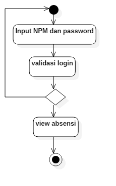
Gambar 3.34 Statechart Diagram Monitoring Absensi via Web

Keterangan:
Sebenarnya untuk melihat absensi ini semua aktor bisa melihat absensi, tetapi yang ditekankan dalam memonitoring absensi mahasiswa ini jadi orangtua dan mahasiswa bisa mengetahui absensinya melalui web ini dengan syarat mahasiswa atau orang tua harus login terlebih dahulu dengan memasukan NPM dan passwordnya. 

3.2.7   Component Diagram

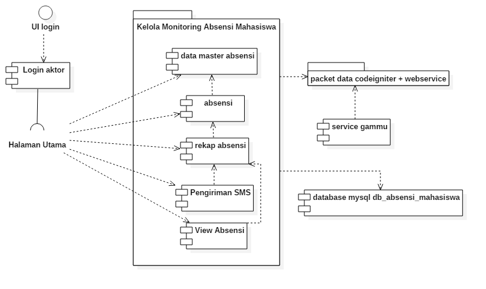 
Gambar 3.35 Component Diagram Sistem Monitoring Absensi Mahasiswa
Keterangan:
Gambar 3.35 menunjukan gambaran sebuah komponen dalam system dimana:
1.	Aktor menghadapi UI login dan melakukan login.
2.	Masuk ke halaman utama.
3.	Kemudian masuk ke dalam system
4.	Sistem tersebut terdiri dari beberapa komponen yaitu data master untuk absensi seperti ruangan, kelas, matakuliah, mahasiswa, dosen dll. Selain itu juga terdapat komponen seperti absensi, rekap absensi, pengiriman SMS dan view absensi. 
5.	Sistem terhubung dengan sebuah komponen database yang bernama db_absensi_mahasiswa.
6.	Adapun untuk pembuatan systemnya menggunakan framework CodeIgniter dan untuk sms gatewaynya menggunakan service gammu.

3.2.8   Deployment Diagram
3.2.8.1	Deployment Diagram Software

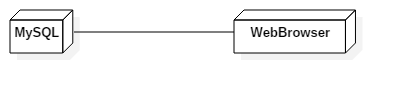 
Gambar 3.36 Deployment Diagram Software

3.2.8.2	Deployment Diagram Hardware

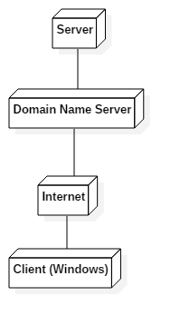 
Gambar 3.37 Deployment Diagram Hardware

3.2.9	Struktur Menu

 
Gambar 3.38 Struktur Menu Sistem Monitoring Absensi Mahasiswa

3.2.10 Perancangan Antarmuka

  
Gambar 3.39 UI Login
Keterangan:
Gambar 3.39 adalah perancangan antar muka untuk login dengan parameter inputan berupa username dan password yang diperuntukan oleh administrator dan dosen, sedangkan untuk orangtua dan mahasiswa inputannya yaitu NPM dan password agar bisa mengelola absensi mahasiswa.

  
Gambar 3.40 UI Halaman Utama Admin
Keterangan:
Pada gambar 3.40 menggambarkan tentang Perancangan Antarmuka Halaman Utama Administrator. Dimana terdapat menu-menu navigasi diantaranya beranda, data master, absensi, layanan SMS, jadwal dan alat. 

 
Gambar 3.41 UI Kelola data Absensi, Rekap Absensi dan View Data Kotak Masuk, Kotak Keluar
Keterangan:
Gambar tersebut merupakan perancangan interface dari view data untuk data absensi, rekap absensi dan view data kotak masuk, kotak keluar.

  
Gambar 3.42 UI Form  Input Data
Keterangan:
Gambar tersebut merupakan perancangan interface dari layanan sms berupa kirim sms atau pesan.

  
Gambar 3.43 UI Halaman Utama Dosen
Keterangan: 
Pada gambar 3.43 menggambarkan tentang Perancangan Antarmuka Halaman Utama Dosen. Dimana terdapat menu-menu navigasi diantaranya beranda dan absensi. 

  
Gambar 3.44 UI Halaman Utama Orangtua dan Mahasiswa
Keterangan: 
Pada gambar 3.44 menggambarkan tentang Perancangan Antarmuka Halaman Utama Orangtua dan Mahasiswa. Dimana terdapat menu-menu diantaranya beranda dan view absensi. 

