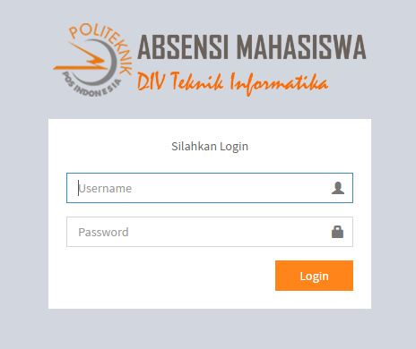
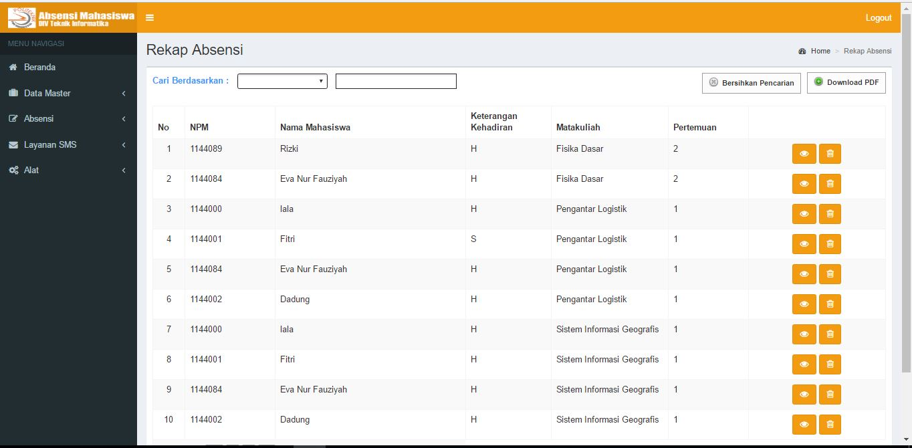

<h2 align="center">BAB IV 
IMPLEMENTASI DAN PENGUJIAN</h2>
 

&nbsp;&nbsp;&nbsp;&nbsp;&nbsp;&nbsp;Implementasi merupakan sistem atau aplikasi yang dibuat dengan merinci komponen-komponen pendukung berupa program, lingkungan implementasi, tampilan antarmuka, dan petunjuk pemakaian. 

<strong>4.1	Lingkungan Implementasi</strong> 
&nbsp;&nbsp;&nbsp;&nbsp;&nbsp;&nbsp;Perancangan aplikasi ini dapat berjalan dengan baik karena didukung oleh perangkat pendukung yaitu perangkat lunak dan perangkat keras. 

4.1.1	Kebutuhan Perangkat Lunak 
&nbsp;&nbsp;&nbsp;&nbsp;&nbsp;&nbsp;Perangkat lunak pendukung yang digunakan adalah sebagai berikut. 
Tabel 4.1 Deskripsi Perangkat Lunak 
No.	Jenis	 	Keterangan 
1	Sistem Operasi	:	Microsoft Windows 8 Profesional 32-Bit 
2	Bahasa Pemrograman 	:	Php 
3	Database 	:	MySQL 
4	Perangkat Lunak	:	Dreamweaver CS5 
5	Service SMS Gateway	:	Gammu 1.28.90 
 
4.1.2	Kebutuhan Perangkat Keras 
&nbsp;&nbsp;&nbsp;&nbsp;&nbsp;&nbsp;Perangkat keras pendukung yang digunakan adalah sebagai berikut.  
Tabel 4.2 Deskripsi Perangkat Keras  
No.	Jenis	 	Keterangan 
1	Processor	:	Intel® core™i3  
2	Memory	:	4 GB 
3	Monitor	:	LCD 14,1 Inchi 
4	Mouse dan keyboard	:	Standard 
5	Modem	:	ZTE MF190  
 
4.2	Pembahasan Hasil Implementasi 
&nbsp;&nbsp;&nbsp;&nbsp;&nbsp;&nbsp;Berdasarkan perancangan yang telah dibuat, didapat hasil dari implementasi yang menjadi tujuan pembuatan perangkat lunak ini yaitu dapat Memonitoring Absensi Mahasiswa Program Studi DIV Teknik Informatika di Politeknik Pos Indonesia. 
 
4.2.1	Form Login 
&nbsp;&nbsp;&nbsp;&nbsp;&nbsp;&nbsp;Untuk menggunakan aplikasi ini, user/admin harus login terlebih dahulu dengan memasukkan username dan password pada form Login dibawah ini. Hak akses user terbagi menjadi 3 level, yaitu administrator yang merupakan Petugas BAAK, dosen untuk menginputkan absensi dan mahasiswa atau orangtua untuk melihat atau memonitoring absensi. Untuk login hanya mengklik button Login. 
 

 Gambar 4. 1 Form Login 

 
4.2.2	Form Kelola Absensi 

&nbsp;&nbsp;&nbsp;&nbsp;&nbsp;&nbsp;Berikut adalah kelola absensi untuk system absensi mahasiswa, dimana dosen yang menginputkan absensi tersebut sesuai dengan keadaan para mahasiswa, dosen hanya disediakan radiobutton untuk memilih salah satu apakah mahasiswa hadir, sakit, ijin atau alfa, kemudian klik save untuk menyimpannya. Adapun untuk kelola absensi ini tidak hanya input absensi saja, tetapi termasuk dengan data-data master yang digunakan untuk keperluan input absensi. 
 

 Gambar 4.2 Form Kelola Absensi 

 
4.2.3	Form Kelola Rekap Absensi 
 
 
 Gambar 4.3 Form Kelola Rekap Absensi 

 

Keterangan: 
&nbsp;&nbsp;&nbsp;&nbsp;&nbsp;&nbsp;Gambar 4.3 merupakan rekap absensi dimana form tersebut difasilitasi searching, berdasarkan kelas, kemudian akan muncul data yang dibutuhkan. Button bersihkan pencarian berguna untuk mengembalikan view data sebelum melakukan pencarian. Adapun rekap absensi ini berisi data data rekapan dari absensi yang telah diinputkan dosen sebelumnya, selain itu di menu  rekap absensi ini akan dimunculkan info pelanggaran kehadiran seperti SP1, SP2, dan SP3 di menu pelanggaran.  

4.2.4	Form Monitoring Absensi Mahasiswa via SMS 
  
 
  Gambar 4.4 Form Layanan SMS Kirim Pesan 

 
  
Gambar 4.5 Form Layanan SMS Kotak Masuk 

 
  
Gambar 4.6 Form Layanan SMS Kotak Keluar 

 
  
Gambar 4.7 Form Layanan SMS Log Kotak Masuk 

 
  
Gambar 4.8 Form Layanan SMS Log Kotak Keluar 

Keterangan: 
&nbsp;&nbsp;&nbsp;&nbsp;&nbsp;&nbsp;Gambar 4.4, 4.5, 4.6, dan 4.7, 4.8 merupakan Form untuk memonitoring Absensi Mahasiswa melalui SMS. Pada layanan sms yang disediakan oleh aplikasi ini berupa kirim pesan untuk mengirim sms, kotak masuk untuk mengelola sms yang masuk ke dalam sistem monitoring absensi, dan kotak keluar untuk mengecek sms apa saja yang berhasil terkirim. Selain itu dalam layanan sms ini disediakan log sms seperti riwayat sms, kapan mengirim sms, kapan menerima sms.   

4.2.5	Form  Monitoring Absensi Mahasiswa via Web 
  
 
  Gambar 4.8 Form Halaman Utama  Orangtua dan Mahasiswa 

  

Keterangan: 
&nbsp;&nbsp;&nbsp;&nbsp;&nbsp;&nbsp;Orangtua dan mahasiswa hanya bisa melihat/ view absensi guna untuk memonitoring absensi mahasiswa khusus untuk Program Studi DIV Teknik Informatika.
 
4.3  Pengujian dan Hasil Pengujian 
4.3.1 Identifikasi dan Rencana Pengujian 
Tabel 4.3 Identifikasi dan Rencana Pengujian 
Identifikasi SKPL	Kelas Uji	Butir Uji	Tingkat Pengujian	Jenis Pengujian	Jadwal Pegujian
SKPL 01	Validasi Login	Validasi Login	Pengujian Sistem	Black Box	16/01/17
SKPL 02	Pengujian Menu Absensi	-	Form Absensi
-	Form Rekap Absensi
-	Form Kelas	Pengujian Sistem	Black Box	16/01/17
SKPL 03	Pengujian Menu Layanan SMS	-	Form Kirim Pesan
-	Form Kotak Masuk
-	Form Kotak Keluar	Pengujian Sistem	Black Box	16/01/17
SKPL 04	Pengujian Menu View Absensi	-	Form View Absensi	Pengujian Sistem	Black Box	16/01/16
SKPL 05	Pengujian Menu Alat	-	Form Pengguna
-	Form Kelompok	Pengujian Sistem	Black Box	16/01/17
SKPL 06	Pengujian Logout	-	Logout	Pengujian Sistem	Black Box	16/01/17

4.3.2 Deskripsi dan Hasil Uji
4.3.2.1 Kelas Uji Form Login
Tabel 4.4 Kelas  Uji Form Login

Identi-fikasi	Deskripsi	Prosuder Pengujian	Masukan	Keluaran yang diharapkan	Kriteria evaluasi hasil	Hasil yang didapat	Kesimpulan
SKPL 101	Pengujian Button Login Level 	-Masukan username dan password
-Klik Login	Ketik username dan password	Tampil menu utama sesuai level	Menu utama langsung ditampil-kan	Sesuai dengan yang diharapkan	Teruji

4.3.2.2 Kelas Uji Kelola Absensi 
Tabel 4.5 Kelas Uji Kelola Absensi
Identi-fikasi	Deskripsi	Prosuder Pengujian	Masukan	Keluaran yang diharapkan	Kriteria evaluasi hasil	Hasil yang didapat	Kesimpulan
SKPL 201	Pengujian  Input Absensi Mahasiswa oleh Dosen	-Search berdasarkan kelas
-Pilih kelas
-Pilih pertemuan
-Pilih semester
-Pilih Matakuliah
-Pilih salah satu radio button keterangan kehadiran seperti sakit, iji, alfa.
-Klik button simpan
	Input absensi	Data yang diinputkan tersimpan di database dan masuk ke dalam rekapan absensi	Data yang diinputkan tersimpan di database dan masuk ke dalam rekapan absensi	Sesuai dengan yang diharapkan	Teruji
SKPL 202	Pengujian searching	-Pilih option cari berdasarkan kelas
-Ketik keyword data yang akan dicari
-Klik button Cari.	Masukan keyword data yang akan dicari 	Menampilkan data yang dicari.	Menampikan data yang dicari yang sebelum-nya tersimpan di dalam database.	Sesuai dengan yang diharapkan	Teruji

4.3.2.3 Kelas Uji Kelola Rekap Absensi
Tabel 4.6 Kelas Uji Kelola Rekap Absensi
Identi-fikasi	Deskripsi	Prosuder Pengujian	Masukan	Keluaran yang diharapkan	Kriteria evaluasi hasil	Hasil yang didapat	Kesimpulan
SKPL 205	Pengujian  View Rekap Absensi	-Pilih sub menu rekap absensi dalam menu absensi	-	Menampilkan list absensi yang telah direkap	Tampil rekap absensi	Sesuai dengan yang diharapkan	Teruji
SKPL 206	Pengujian searching	-Pilih option cari berdasarkan apa yang dibutuhkan
-Ketik keyword data yang akan dicari
-Klik button Cari.	Ketik keyword data yang akan dicari
	Menampilkan data yang dicari.	Menampikan data yang dicari yang sebelumnya tersimpan di dalam database.	Sesuai dengan yang diharapkan	Teruji
SKPL 207	Pengujian download PDF	-Pilih button download	-	Data rekapan absensi terdownload dan tersimpan di folder download dengan format pdf	Data rekapan absensi terdownload dan tersimpan di folder download dengan format pdf	Sesuai dengan yang diharapkan	Teruji

4.3.2.4 Kelas Uji Kelola Kirim Pesan
Tabel 4.7 Kelas Uji Kelola Kirim Pesan
Identi-fikasi	Deskripsi	Prosuder Pengujian	Masukan	Keluaran yang diharapkan	Kriteria evaluasi hasil	Hasil yang didapat	Kesimpulan
SKPL 301	Pengiriman SMS	-Masukan no tujuan
-Masukan isi pesan
-Klik kirim pesan	No tujuan dan isi pesan sms	Isi pesan yanng diinputkan oleh admin bisa diterima oleh no tujuan (no orangtua mahasiswa)	Pengiriman sms ke no tujuan berhasil terkirim.	Sesuai dengan yang diharapkan	Teruji

4.3.2.5 Kelas Uji Kotak Masuk
Tabel 4.8 Kelas Uji Kotak Masuk
Identi-fikasi	Deskripsi	Prosuder Pengujian	Masukan	Keluaran yang diharapkan	Kriteria evaluasi hasil	Hasil yang didapat	Kesimpulan
SKPL 302	Pengujian  view kotak masuk	-Pilih sub menu kotak masuk dalam menu layanan sms	-	Menampilkan list pesan yang masuk ke dalam sistem	Isi pesan yang diterima ter-list di halaman kotak masuk	Sesuai dengan yang diharapkan	Teruji
SKPL 303	Pengujian Detail Pesan Masuk	-Klik salah satu button detail pada kolom aksi di kotak masuk

	-	Menampilkan isi pesan secara detail dengan dilengkapi fitur balas sms	Menampilkan isi pesan secara detail.	Sesuai dengan yang diharapkan	Teruji
SKPL 304	Pengujian Hapus Kotak Masuk	-Klik button   pada kolom aksi yang akan dihapus barisnya/ record data.	Tidak ada	Data yang dipilih untuk dihapus akan.	Data yang telah diklik button   secara otomatis.	Sesuai dengan yang diharapkan	Teruji

4.3.2.6 Kelas Uji Kotak Keluar
Tabel 4.9 Kelas Uji Kotak Keluar
Identi-fikasi	Deskripsi	Prosuder Pengujian	Masukan	Keluaran yang diharapkan	Kriteria evaluasi hasil	Hasil yang didapat	Kesimpulan
SKPL 305	Pengujian  view kotak keluar	-Pilih sub menu kotak keluar dalam menu layanan sms	-	Menampilkan list pesan yang telah dikirimkan ke no tujuan	Isi pesan yang telah dikirim ter-list di halaman kotak keluar	Sesuai dengan yang diharapkan	Teruji
SKPL 306	Pengujian Detail Pesan Keluar	-Klik salah satu button detail pada kolom aksi di kotak keluar

	-	Menampilkan isi pesan secara detail 	Menampilkan isi pesan secara detail.	Sesuai dengan yang diharapkan	Teruji
SKPL 307	Pengujian Hapus Kotak Keluar	-Klik button   pada kolom aksi yang akan dihapus barisnya/ record data.	Tidak ada	Data yang dipilih untuk dihapus akan.	Data yang telah diklik button   secara otomatis.	Sesuai dengan yang diharapkan	Teruji

4.3.2.7 Kelas Uji View Absensi
Tabel 4.10 Kelas Uji View Absensi
Ideti-fikasi	Deskripsi	Prosuder Pengujian	Masukan	Keluaran yang diharapkan	Kriteria evaluasi hasil	Hasil yang didapat	Kesimpulan
SKPL 401	Pengujian  searching	-Pilih cari berdasarkan apa yang dibutuhkan
-Masukan keyword
-Enter	Masukan keyword untuk searching	Menampilkan data yang dicari.	Menampikan data yang dicari yang sebelumnya tersimpan di dalam database.	Sesuai dengan yang diharapkan	Teruji
SKPL 402	Pengujian View Absensi	-User login terlebih dahulu
-Lihat absensi
	-	Data absensi tampil dalam konten	Data absensi tampil dalam konten	Sesuai dengan yang diharapkan	Teruji

4.3.2.8 Kelas Uji Kelola Kelompok
Tabel 4.11 Kelas Uji Kelola Kelompok
Ideti-fikasi	Deskripsi	Prosuder Pengujian	Masukan	Keluaran yang diharapkan	Kriteria evaluasi hasil	Hasil yang didapat	Kesimpulan
SKPL 501	Pengujian  Tambah data Kelompok	-Klik button tambah data
-Masukan data
-Klik Simpan Data	Input data Kelompok	Data yang diinputkan tersimpan di database dan tampil pada form kelola Kelompok	Data yang diinputkan tersimpan di database dan tampil form kelola Kelompok.	Sesuai dengan yang diharapkan	Teruji
SKPL 502	Pengujian Ubah data Kelompok	-Klik button   pada kolom aksi di dalam tampilan view data. 
- Ubah data yang salah
- Klik Simpan Data	Masukan data Kelompok yang akan diperbaiki	Data yang telah diedit tersimpan dan terubah di dalam database dan tampil pada  form kelola Kelompok	Data Kelompok berhasil dirubah.	Sesuai dengan yang diharapkan	Teruji
SKPL 503	Pengujian Hapus data Kelompok	-Klik button   pada kolom aksi yang akan dihapus barisnya/ record data.
	Tidak ada	Data yang dipilih untuk dihapus akan hilang 	Data yang telah diklik button   secara otomatis akan terhapus.	Sesuai dengan yang diharapkan	Teruji
SKPL 504	Pengujian searching	-Pilih option cari berdasarkan apa yang dibutuhkan
-Ketik keyword data yang akan dicari
-Klik button Cari.	Ketik keyword data yang akan dicari
	Menampilkan data yang dicari.	Menampikan data yang dicari yang sebelumnya tersimpan di dalam database.	Sesuai dengan yang diharapkan	Teruji

4.3.2.9 Kelas Uji Kelola Pengguna
Tabel 4.12 Kelas Uji Kelola Pengguna
Identi-fikasi	Deskripsi	Prosuder Pengujian	Masukan	Keluaran yang diharapkan	Kriteria evaluasi hasil	Hasil yang didapat	Kesimpulan
SKPL 505	Pengujian  Tambah data Pengguna	-Klik button tambah data
-Masukan data
-Klik Simpan Data	Input data Pengguna	Data yang diinputkan tersimpan di database dan tampil pada form kelola Pengguna	Data yang diinputkan tersimpan di database dan tampil form kelola Pengguna.	Sesuai dengan yang diharapkan	Teruji
SKPL 506	Pengujian Ubah data Pengguna	-Klik button   pada kolom aksi di dalam tampilan view data. 
- Ubah data yang salah
- Klik Simpan Data	Masukan data Pengguna yang akan diperbaiki	Data yang telah diedit tersimpan dan terubah di dalam database dan tampil pada  form kelola Pengguna	Data Pengguna berhasil dirubah.	Sesuai dengan yang diharapkan	Teruji
SKPL 507	Pengujian Hapus data Pengguna	-Klik button   pada kolom aksi yang akan dihapus barisnya/ record data.
	Tidak ada	Data yang dipilih untuk dihapus akan hilang 	Data yang telah diklik button   secara otomatis akan terhapus.	Sesuai dengan yang diharapkan	Teruji
SKPL 508	Pengujian searching	-Pilih option cari berdasarkan apa yang dibutuhkan
-Ketik keyword data yang akan dicari
-Klik button Cari.	Ketik keyword data yang akan dicari
	Menampilkan data yang dicari.	Menampikan data yang dicari yang sebelumnya tersimpan di dalam database.	Sesuai dengan yang diharapkan	Teruji

4.3.2.13 Kelas Uji Logout
Tabel 4.15 Kelas  Uji Logout
Identi-fikasi	Deskripsi	Prosuder Pengujian	Masukan	Keluaran yang diharapkan	Kriteria evaluasi hasil	Hasil yang didapat	Kesimpulan
601	Pengujian Logout 	Klik logout pada pojok kanan atas
	Tidak ada	Keluar dari system absensi mahasiswa dan ketika diklik back, tidak akan kembali ke sistem. (harus login lagi)	Keluar dari system dan ketika diklik back, tidak akan kembali ke sistem. (harus login lagi)	Sesuai dengan yang diharapkan	Teruji

