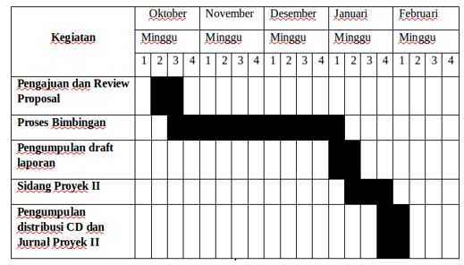

<h2 align="center"BAB I  PENDAHULUAN </h2>
 
<strong>1.1	Latar Belakang Masalah</strong>

&nbsp;&nbsp;&nbsp;&nbsp;&nbsp;&nbsp;Politeknik Pos Indonesia adalah sebuah kampus yang mempunyai 9 prodi salah satu di antaranya yaitu D4 Teknik Informatika. DIV Teknik Informatika Politeknik Pos Indonesia adalah sebuah program studi yang bergerak dalam IT yang di dalamnya terdapat 3 kelas untuk tingkat I, 4 kelas untuk tingkat II, 4 kelas untuk tingkat III dan 2 kelas untuk tingkat IV yang sedang menjalankan Internship (praktek kerja di perusahaan). Total mahasiswa DIV Teknik Informatika Politeknik Pos Indonesia yang aktif mengikuti perkuliahan di kampus kecuali mahasiswa tingkat IV mencapai kurang lebih 350 mahasiswa.
Dari jumlah mahasiswa DIV Teknik Informatika Politeknik Pos Indonesia tersebut dalam kegiatan absensi perkuliahan masih memanfaatkan kertas dan pena sebagai sarana absensi. Kertas absensi diestafetkan dari mahasiswa yang satu ke mahasiswa yang lainnya tanpa terjamin absensi yang diisikan sesuai dengan kenyataan atau ada yang memanipulasi absensi tersebut.
Dalam kegiatan absensi mahasiswa tentu harus diadakannya pengawasan yang ketat baik itu dari pihak kampus seperti wali dosen, prodi atau dari luar kampus seperti orang tua mahasiswa itu sendiri.  Sehingga ketiga pihak tersebut bisa mengontrol anak didiknya dalam kehadiran perkuliahan, sehingga jika mahasiswa banyak yang tidak hadir tanpa adanya keterangan, sakit atau ijin mereka semua bisa tahu bahkan bisa mengetahui anak didiknya jika mendapatkan SP (Surat Peringatan) 1, SP 2, SP 3 atau DO (drop out).  
&nbsp;&nbsp;&nbsp;&nbsp;&nbsp;&nbsp;Data absensi ini menjadi perhatian serius mengingat kehadiran mahasiswa menjadi salah satu tolak ukur aktivitas mahasiswa dalam proses perkuliahan. Kesulitan yang sering ditemui adalah pada saat akan melakukan rekapitulasi data. Berkas/dokumen absensi harus dikumpulkan kemudian dikalkulasi. Hal ini sangat merepotkan mengingat banyaknya mahasiswa yang terdistribusi dalam setiap kelas. 
&nbsp;&nbsp;&nbsp;&nbsp;&nbsp;&nbsp;Berdasarkan data dan fakta yang diuraikan di atas, maka diperlukan suatu sistem yang dapat memberikan solusi pada permasalahan tersebut yaitu dengan membangun suatu aplikasi yaitu “Sistem Pengelolaan Data dan Monitoring Absensi pada Program Studi DIV Teknik Informatika Politeknik Pos Indonesia  Menggunakan Framework Code Igniter”.
 
 
<strong>1.2  Identifikasi Masalah</strong> 
&nbsp;&nbsp;&nbsp;&nbsp;&nbsp;&nbsp;Berdasarkan latar belakang di atas maka permasalahan yang di hadapi pada kegiatan absensi mahasiswa program studi DIV Teknik Informatika Politeknik Pos Indonesia diantaranya yaitu kegiatan absensi mahasiswa masih manual dengan diestafetkannya kertas absensi sehingga kurang terjaminnya keaslian data. Selain itu, informasi tentang kehadiran mahasiswa selama perkuliahan tidak sampai kepada orang tua sehingga orang tua tidak tahu apakah anaknya masuk kuliah atau tidak. 
 
 
<strong>1.3	Tujuan</strong> 
&nbsp;&nbsp;&nbsp;&nbsp;&nbsp;&nbsp;Tujuan yang ingin dicapai pada pembuatan aplikasi ini adalah untuk mengelola data absensi mahasiswa secara terkomputerisasi yang diinputkan langsung oleh dosen ke dalam sistem sehingga terjamin keaslian datanya. Selain itu informasi kehadiran perkuliahan mahasiswa bersifat terbuka untuk orang tua, prodi, wali dosen yang mempunyai hak untuk itu.
 
 
<strong>1.4	Ruang Lingkup</strong> 
&nbsp;&nbsp;&nbsp;&nbsp;&nbsp;&nbsp;Adapun batasan masalah yang menjadi ruang lingkup pada pembuatan sistem ini antara lain : 
1.	Aplikasi ini berbasis website menggunakan framework codeigniter pada backend (halaman admin) maupun frontend (halaman user). 
2.	Untuk menjembatani antara backend dan frontend, sistem ini menggunakan web service dan dilengkapi keamanan berupa login untuk admin, wali dosen, prodi, orangtua/mahasiswa.  
3.	Aplikasi ini hanya memuat absensi untuk mahasiswa DIV Teknik Informatika, tidak untuk dosen atau pegawai Politeknik Pos Indonesia. 
4.	Untuk pengelolaan data absensi pada halaman admin terdapat data master yang meliputi data mahasiswa, data mata kuliah, data dosen, data kelas serta proses untuk melakukan absensi. Untuk user prodi dan orang tua/mahasiswa, mereka hanya bisa melihat absensi.  
5.	Aplikasi ini digunakan oleh 4 macam user. Pertama yaitu admin yang mengelola sistem  dan yang kedua yaitu wali dosen, lalu yang ketiga yaitu prodi dan yang terakhir yaitu orangtua/mahasiswa. 
6.	Database yang digunakan adalah Mysql. 
7.	Untuk memonitoring absensi, orang tua bisa mengeceknya pada website yang telah disediakan dengan memasukan NPM dan password anaknya.
 
 
<strong>1.5	Jadwal Kegiatan Pekerjaan Proyek</strong> 
 
1.1 Jadwal Kegiatan Pekerjaan Proyek

