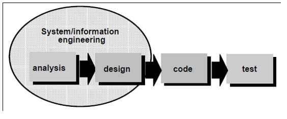

<h2 align="center">BAB II LANDASAN TEORI </h2>

<strong>2.1	Pengertian Sistem</strong> 
&nbsp;&nbsp;&nbsp;&nbsp;&nbsp;&nbsp;Sistem (<i>system</i>) dapat didefinisikan dengan pendekatan prosedur dan dengan pendekatan komponen. “Dengan pendekatan prosedur, sistem dapat didefinisikan sebagi kumpulan dari prosedur–prosedur yang mempunyai tujuan tertentu”.[5]  
 
<strong>2.2	Pengertian Absensi</strong> 
&nbsp;&nbsp;&nbsp;&nbsp;&nbsp;&nbsp;Menurut Erna Simona (2009). Absensi adalah suatu pendataan kehadiran, bagian dari pelaporan aktifitas suatu instansi, atau komponen institusi itu sendiri yang berisi data-data kehadiran yang disusun dan diatur sedemikian rupa sehingga mudah untuk dicari dan dipergunakan apabila sewaktu-waktu diperlukan oleh pihak yang berkepentingan. 
Ada dua jenis absensi menurut cara penggunaannya, diantaranya yaitu: 
a.	Absensi manual, adalah cara pengentrian kehadiran dengan cara menggunakan pena (tanda tangan). 
b.	Absensi non manual (dengan menggunakan alat), adalah suatu cara pengentrian kehadiran dengan menggunakan sistem  terkomputerisasi. [6] 
 
<strong>2.3	Pengertian Monitoring Absensi</strong> 
&nbsp;&nbsp;&nbsp;&nbsp;&nbsp;&nbsp;Monitoring merupakan aktivitas yang dilakukan pimpinan untuk melihat, memantau jalannya organisasi selama kegiatan berlangsung, dan menilai ketercapaian tujuan, melihat faktor pendukung dan penghambat pelaksanaan program. Dalam monitoring (pemantauan) dikumpulkan data dan dianalisis, hasil analisis diinterpretasikan dan dimaknakan sebagai masukan bagi pimpinan untuk mengadakan perbaikan. 
&nbsp;&nbsp;&nbsp;&nbsp;&nbsp;&nbsp;Adapun monitoring absensi menurut definisi di atas adalah aktivitas yang dilakukan pimpinan atau pihak terkait guna untuk melihat, memantau jalannya sebuah absensi perkuliahan mahasiswa dan meniliai ketercapainnya tujuan dan faktor penghambat pelaksanaan program kehadiran perkuliahan.[3] 
 
<strong>2.4	Program Studi DIV Teknik Informatika Politeknik Pos Indonesia</strong> 
&nbsp;&nbsp;&nbsp;&nbsp;&nbsp;&nbsp;Politeknik Pos Indonesia adalah sebuah kampus yang terletak di Jl. Sari Asih No. 54 Bandung. Kampus tersebut kini telah memiliki 9 program studi, salah satu di antaranya adalah DIV Teknik Informatika.  
&nbsp;&nbsp;&nbsp;&nbsp;&nbsp;&nbsp;DIV Teknik Informatika adalah sebuah program studi yang merupakan diploma IV (setara dengan S1) yang sasarannya yaitu menghasilkan generasi yang siap dalam kerja nyata di perusahaan-perusahaan atau instansi lainnya yang di dalamnya lebih ditekankan kepada praktek. Kini pada tahun 2016, jumlah mahasiswa DIV Teknik Informatika Politeknik Pos Indonesia mencapai kurang lebih 400 mahasiswa dengan rincian 3 kelas dari tingkat I, 4 kelas dari tingkat II, 4 kelas dari tingkat III, dan 2 kelas dari tingkat IV. 
 
<strong>2.5	<i>CodeIgniter</i></strong> 
&nbsp;&nbsp;&nbsp;&nbsp;&nbsp;&nbsp;<i>CodeIgniter</i> merupakan aplikasi sumber terbuka yang berupa <i>framework PHP</i> dengan model <i>MVC(Model, View, Controller)</i> untuk membangun <i>website</i> dinamis dengan menggunakan PHP.  <i>Codeigniter</i> memudahkan <i>developer</i> untuk membuat aplikasi web dengan cepat mudah dibandingkan dengan membuatnya dari awal.[2]  
 
<strong>2.6	<i>PHP</i></strong> 
&nbsp;&nbsp;&nbsp;&nbsp;&nbsp;&nbsp;<i>PHP :Hypertext Preprocessor</i> adalah bahasa skrip yang dapat ditanamkan atau disisipkan ke dalam HTML. PHP banyak dipakai untuk memprogram situs web dinamis. PHP dapat digunakan untuk membangun sebuah CMS. Pada awalnya PHP merupakan kependekan dari <i>Personal Home Page</i> (Situs personal). PHP pertama kali dibuat oleh Rasmus Lerdorf pada tahun 1995. Pada waktu itu PHP masih bernama Form Interpreted (FI), yang wujudnya berupa sekumpulan skrip yang digunakan untuk mengolah data formulir dari web.[1]  
 
<strong>2.7	Basis Data / <i>Database</i></strong> 
&nbsp;&nbsp;&nbsp;&nbsp;&nbsp;&nbsp;<i>Database</i> adalah suatu kumpulan data yang saling berhubungan secara logis dan penjelasan tentang data yang terhubung tersebut dirancang sedemikian rupa sehingga dapat memberikan informasi yang diperlukan oleh organisasi. (Connolly,2010,p65).
Istilah "basis data" berawal dari ilmu komputer. Meskipun kemudian artinya semakin luas, memasukkan hal-hal di luar bidang elektronika, artikel ini mengenai basis data komputer. Catatan yang mirip dengan basis data sebenarnya sudah ada sebelum revolusi industri yaitu dalam bentuk buku besar, kuitansi dan kumpulan data yang berhubungan dengan bisnis. 
&nbsp;&nbsp;&nbsp;&nbsp;&nbsp;&nbsp;;Bahasa yang digunakan untuk Database yang akan dibuat yaitu SQL. <i>SQL (Structured Query Language)</i> adalah sebuah bahasa yang digunakan untuk mengakses data dalam basis data relasional. Bahasa ini secara de facto merupakan bahasa standar yang digunakan dalam manajemen basis data relasional. Saat ini hampir semua server basis data yang mendukung bahasa ini untuk melakukan manajemen datanya.
Secara umum, SQL terdiri dari dua bahasa, yaitu <i>Data Definition Language (DDL)</i> dan <i>Data Manipulation Language (DML)</i>. Implementasi DDL dan DML berbeda untuk tiap system manajemen basis data (SMBD),  namun secara umum implementasi tiap bahasa ini memiliki bentuk standar yang ditetapkan ANSI. Artikel ini akan menggunakan bentuk paling umum yang dapat digunakan pada kebanyakan SMBD.[6]  
<strong>2.8	<i>XAMPP</i></strong> 
&nbsp;&nbsp;&nbsp;&nbsp;&nbsp;&nbsp;<i>XAMPP</i> adalah perangkat lunak bebas, yang mendukung banyak sistem operasi, merupakan kompilasi dari beberapa program. 
&nbsp;&nbsp;&nbsp;&nbsp;&nbsp;&nbsp;Fungsinya adalah sebagai server yang berdiri sendiri <i>(localhost)</i>, yang terdiri atas program <i>Apache HTTP Server, MySQL database,</i> dan penerjemah bahasa yang ditulis dengan bahasa pemrograman PHP dan Perl. Nama XAMPP merupakan singkatan dari X (empat system operasi apapun), Apache, MySQL, PHP dan Perl. [9]  
 
<strong>2.9	<i>Flowchart/Flowmap</i></strong> 
&nbsp;&nbsp;&nbsp;&nbsp;&nbsp;&nbsp;<i>Flowchart/Flowmap</i> adalah penggambaran secara grafik dari langkah-langkah dan urut-urutan prosedur dari suatu program. <i>Flowchart/Flowmap</i> menolong analis dan programmer untuk memecahkan masalah ke dalam segmen-segmen yang lebih kecil dan menolong dalam menganalisis alternatif-alternatif lain dalam pengoperasian. <i>Flowchart/Flowmap</i> biasanya mempermudah penyelesaian suatu masalah khususnya masalah yang perlu dipelajari dan dievaluasi lebih lanjut.[7]  
 
<strong>2.10	<i>UML (Unifed Modeling Language)</i></strong> 
&nbsp;&nbsp;&nbsp;&nbsp;&nbsp;&nbsp;<i>UML (Unifed Modeling Language)</i> adalah himpunan struktur dan teknik untuk pemodelan desain program berorientasi objek (OOP) serta aplikasinya. 
1.	<i>Usecase</i> 
&nbsp;&nbsp;&nbsp;&nbsp;&nbsp;&nbsp;<i>Diagram Usecase</i> memiliki komponen-komponen yaitu: Usecase, Actor, lingkup sistem, dan garis relasi. Berikut merupakan bentuk-bentuk dari komponen diagram Usecase. Usecase digunakan untuk memodelkan bisnis proses berdasarkan perspektif pengguna sistem.Usecase diagram terdiri atas diagram untuk usecase dan actor. Actor merepresentasikan orang yang akan mengoperasikan atau orang yang berinteraksi dengan sistem aplikasi. Usecase merepresentasikan operasi – operasi yang dilakukan oleh actor. Usecase digambarkan berbentuk elips dengan nama operasi dituliskan didalamnya. Actor yang melakukan operasi dihubungkan dengan garis lurus ke Usecase.[4] 
2.	<i>Class Diagram</i> 
&nbsp;&nbsp;&nbsp;&nbsp;&nbsp;&nbsp;<i>Class Diagram</i> menggambarkan struktur statis class di dalam sistem. Class merepresentasikan sesuatu yang ditangani oleh sistem. Class dapat berhubungan dengan yang lain melalui berbagai cara: Associated (terhubung satu sama lain), Dependent (satu class tergantung/menggunakan class yang lain), Specialed (satu class merupakan spesialisasi dari class lainnya), atau Package (grup bersama sebagai satu unit). Sebuah sistem biasanya mempunyai beberapa Class Diagram. [12] 
3.	<i>Sequence Diagram</i> 
&nbsp;&nbsp;&nbsp;&nbsp;&nbsp;&nbsp;Diagram Class dan diagram object merupakan suatu gambaran model statis. Namun ada juga yang bersifat dinamis, seperti Diagram Interaction. Diagram Sequence merupakan salah satu Diagram Interaction yang menjelaskan bagaimana suatu operasi itu dilakukan, message (pesan) apa yang dikirim dan kapan pelaksanaannya. Diagram ini diatur berdasarkan waktu. Obyek-obyek yang berkaitan dengan proses berjalannya operasi diurutkan dari kiri ke kanan berdasarkan waktu terjadinya dalam pesan yang terurut. [12] 
4.	<i>Collaboration Diagram</i> 
&nbsp;&nbsp;&nbsp;&nbsp;&nbsp;&nbsp;<i>Collaboration Diagram</i> dipakai untuk memodelkan interaksi antar objek di dalam sistem. Berbeda dengan <i>Sequence Diagram</i> yang lebih menonjolkan kronologis dari operasi-operasi yang dilakukan, <i>Collaboration Diagram</i> lebih fokus pada pemahaman atas keseluruhan operasi yang dilakukan oleh objek. [13]. 
5.	<i>Activity Diagram</i> 
&nbsp;&nbsp;&nbsp;&nbsp;&nbsp;&nbsp;Diagram Aktivitas atau dalam bahasa inggris Activity Diagram adalah representasi grafis dari seluruh tahapan alur kerja. Diagram ini mengandung aktivitas, pilihan tindakan, perulangan dan hasil dari aktivitas tersebut. Pada pemodelan UML, diagram ini dapat digunakan untuk menjelaskan proses bisnis dan alur kerja operasional secara langkah demi langkah dari komponen suatu sistem. [12] 
6.	<i>Component Diagram</i> 
&nbsp;&nbsp;&nbsp;&nbsp;&nbsp;&nbsp;<i>Component Diagram</i> merupakan bagian fisik dari sebuah sistem, karena menetap di komputer tidak berada di benak para analis. Komponen merupakan implementasi software dari sebuah atau lebih class. [12] 
7.	<i>Deployment Diagram</i>
&nbsp;&nbsp;&nbsp;&nbsp;Menggambarkan tata letak sebuah sistem secara fisik, menampakkan bagian-bagian software yang berjalan pada bagian-bagian hardware, menunjukkan hubungan komputer dengan perangkat (nodes) satu sama lain dan jenis hubungannya. [12] 
8.	<i>State Diagram</i>  
&nbsp;&nbsp;&nbsp;&nbsp;&nbsp;&nbsp;Menggambarkan semua state (kondisi) yang dimiliki oleh suatu object dari suatu class dan keadaan yang menyebabkan state berubah. Kejadian dapat berupa object lain yang mengirim pesan. [12]  
 
<strong>2.11	Metodologi Penelitian</strong>  
&nbsp;&nbsp;&nbsp;&nbsp;&nbsp;&nbsp;Metode yang digunakan untuk pengembangan software Sistem Pemesanan Pakaian Custom adalah model <i>Waterfall</i> (Air Terjun). 
 
<strong>2.11.1 Definisi Model <i>Waterfall</i> </strong>
&nbsp;&nbsp;&nbsp;&nbsp;&nbsp;&nbsp;Model Waterfall adalah Model klasik yang bersifat sistematis, berurut anda dalam membangun <i>software</i>.  
-	Tahap pengembangan Model Waterfall menurut Pressman: 

 
Gambar 2.1 Tahap pengembangan Model Waterfall menurut Pressman 
 
-	Tahap pengembangan menurut Sommerville 
•	<i>Requirements analysis and definition</i>: Mengumpulkan kebutuhan secara lengkap kemudian dianalisis dan didefinisikankebutuhan yang harus dipenuhi oleh program yang akan dibangun. Fase ini harus dikerjakan secara lengkap untuk bisa menghasilkan desain yang lengkap. 
•	<i>System and software design</i>: Desain dikerjakan setelah kebutuhan selesai dikumpulkan secara lengkap. 
•	<i>Implementation and unit testing</i>: desain program diterjemahkan ke dalam kode-kode dengan menggunakan bahasa pemrograman yang sudah ditentukan. Program yang dibangun langsung diuji baik secara unit. 
•	<i>Integration and system testing</i>: Penyatuan unit-unit program kemudian diuji secara keseluruhan (system testing). 
•	<i>Operation and maintenance</i>: mengoperasikan program di lingkungannya dan melakukan pemeliharaan, seperti penyesuaian atau perubahan karena adaptasi dengan situasi sebenarnya.[8] 

<strong>2.11.2 Permasalahan model waterfall</strong> 
•	Perubahan sulit dilakukan karena sifatnya yang kaku. 
•	Karena sifat kakunya, model ini cocok ketika kebutuhan dikumpulkan secara lengkap sehingga perubahan bias ditekan sekecil mungkin. Tapi pada kenyataannya jarang sekali konsumen/pengguna yang bisa memberikan kebutuhan secara lengkap, perubahan kebutuhan adalah sesuatu yang wajar terjadi. 
•	Waterfall pada umumnya digunakan untuk rekayasa sistem yang besar dimana proyek dikerjakan di beberapa tempat berbeda, dan dibagi menjadi beberapa bagian sub-proyek.[8] 

